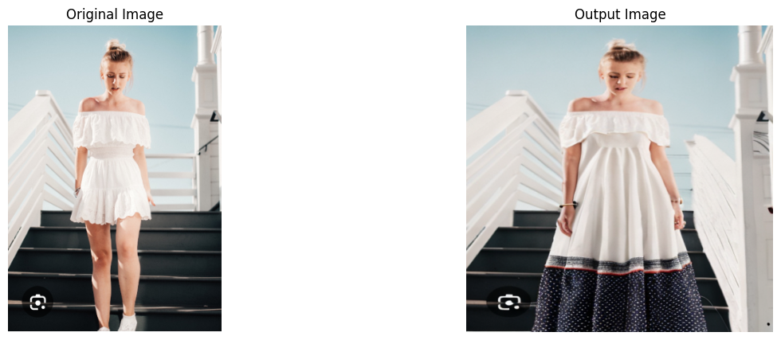
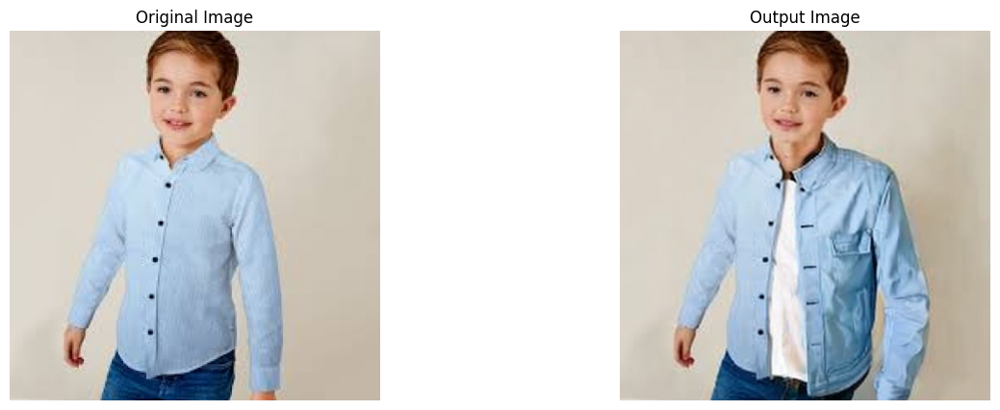

# Dress-Recommendation-Using-Stable-Diffusion-Inpainting
This project leverages the Stable Diffusion Inpainting model to create a personalized dress recommendation system. The system allows users to visualize how different outfits would look on them by seamlessly altering their clothing in existing images.

## Some Results are here,

  
  

